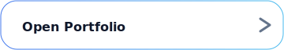
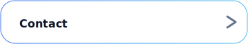
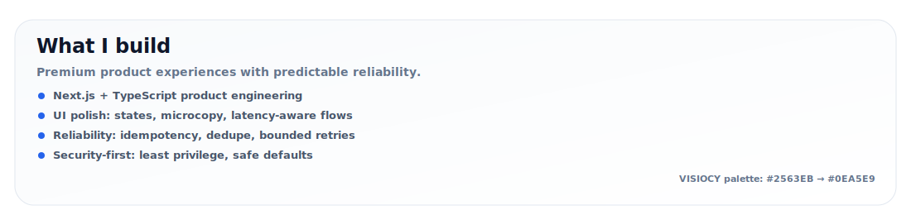
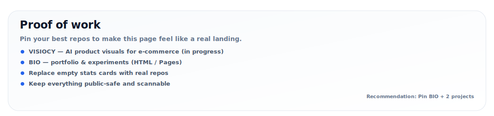
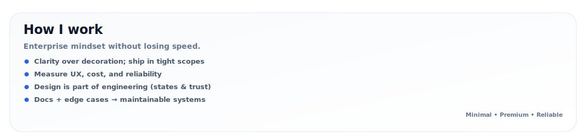
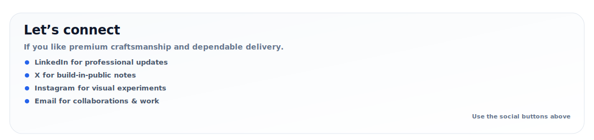

<!-- memisdev — GitHub Landing (Apple + Enterprise) -->

<!-- TODO: Replace placeholders: YOUR_EMAIL / YOUR_LINKEDIN_URL / YOUR_X_URL / YOUR_INSTAGRAM_URL -->

  

 

  
  
  

 

  
  
  
  
  

  

  
  
  
  

  
<strong>Text version (accessible)</strong>

  ### What I build
  - Next.js + TypeScript product engineering
  - Premium UI systems: spacing, states, microcopy
  - Reliability: idempotency, dedupe, bounded retries, QC gates
  - Security-first: least privilege, safe defaults

  ### Proof of work
  - VISIOCY (in progress) — AI product visuals for e-commerce
  - BIO — portfolio & experiments: https://github.com/memisdev/BIO
  - Tip: Pin BIO + 2–3 repos for best landing effect

  ### How I work
  - Clarity over decoration, ship in tight scopes
  - Measure UX/cost/reliability
  - Design is part of engineering

  ### Contact
  - LinkedIn / X / Instagram links above

Last updated: 2026-01
