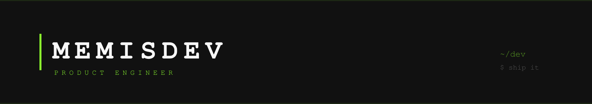
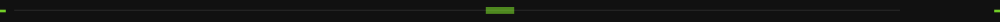
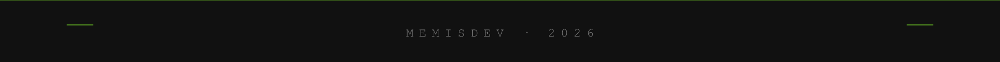

<!-- memisdev — README -->

<div align="center">
  
</div>

<br/>

<div align="center">
  <a href="https://github.com/memisdev">
    
  </a>
</div>

<br/>

<div align="center">
  
</div>

<br/>

<div align="center">
  <samp>

I build products — not prototypes, not demos.  
Full-stack engineer specializing in scalable SaaS products.

  </samp>
</div>

<br/>

<div align="center">
  
</div>

<br/>

<div align="center">

```
STACK
```

</div>

<div align="center">


</div>

<br/>

<div align="center">
  
</div>

<br/>

<div align="center">

```
CURRENTLY BUILDING
```

</div>

<div align="center">

| | |
|---|---|
| **VISIOCY** | AI Product Photography for E-Commerce |
| Stack | Next.js 16 · React 19 · Supabase · Vercel Pro |
| Scope | 15 AI modes · Multi-tenant · Credit-based billing |
| Status | `active` |

</div>

<br/>

<div align="center">
  
</div>

<br/>

<div align="center">

```
ACTIVITY
```

</div>

<div align="center">
  
</div>

<div align="center">
  
</div>

<br/>

<div align="center">
  
</div>

<br/>

<div align="center">

```
CONNECT
```

</div>

<div align="center">

[](mailto:memisdev@gmail.com)&nbsp;&nbsp;
[](https://linkedin.com/in/memisdev)&nbsp;&nbsp;
[](https://x.com/memisdev)&nbsp;&nbsp;
[](https://instagram.com/memisdev)

</div>

<br/>

<div align="center">
  
</div>

<!--  -->
