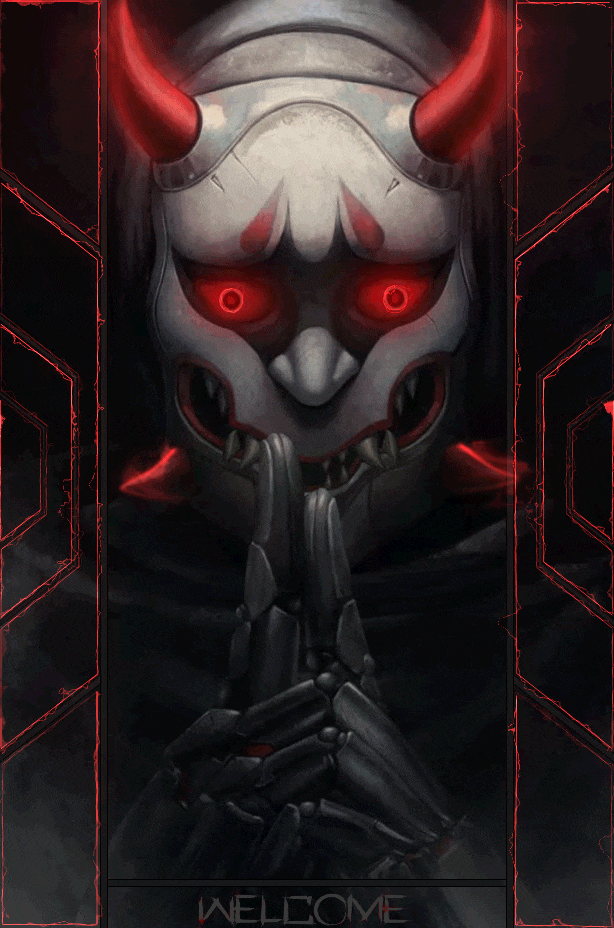

<!-- ═══════════════════════════════════════════════════════════════ -->
<!-- memisdev — Dark Profile                                       -->
<!-- ═══════════════════════════════════════════════════════════════ -->

  

 

  

 

  

 

  

 

  <samp>
    I build products — not prototypes, not demos. 
    Full-stack engineer specializing in AI-powered SaaS. 
    TypeScript that compiles. Tests that catch. Systems that don't page me at 3 AM.
  </samp>

 

  

 

<h3 align="center">⚔️ Arsenal</h3>

 

**Languages**

**Frameworks & Libraries**

**Backend & Data**

**Infrastructure & Tools**

 

  

 

<h3 align="center">🔥 Currently Building</h3>

 

  <table>
    <tr>
      <td width="600" align="center">
        <h3>VISIOCY</h3>
        
<strong>AI Product Photography for E-Commerce</strong>

        

          <samp>15 AI modes · Multi-tenant SaaS · Credit-based billing</samp> 
          <samp>Next.js 16 · React 19 · Supabase · Vercel Pro</samp>
        

        

          
          
        

        

          <samp>35 epics · 85 sprints · 1364 tests passing</samp>
        

      </td>
    </tr>
  </table>

 

  

 

<h3 align="center">📊 Metrics</h3>

 

  
  

 

  

 

  

 

<h3 align="center">📡 Connect</h3>

 

  
  
  
  

 

  

<!-- ═══════════════════════════════════════════════════════════════ -->

<samp>Accessible text version</samp>

### About
Product Engineer building AI-powered SaaS products. Specializing in Next.js, TypeScript, and full-stack development with a focus on reliability and premium UX.

### Current Project
**VISIOCY** — AI Product Photography for E-Commerce. 15 AI modes, multi-tenant architecture, credit-based billing. Built with Next.js 16, React 19, Supabase, and Vercel Pro.

### Contact
- Email: memisdev@gmail.com
- LinkedIn: linkedin.com/in/memisdev
- X: x.com/memisdev
- Instagram: instagram.com/memisdev

