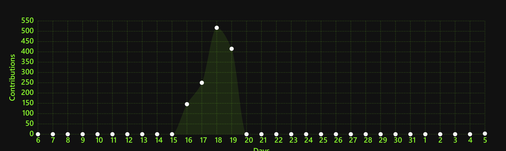

<!-- memisdev — README -->

<div align="center">
  
</div>

<br/>

<div align="center">
  <a href="https://github.com/memisdev">
    
  </a>
</div>

<br/>

<div align="center">
  
</div>

<br/>

<div align="center">
  <samp>

I build products — not prototypes, not demos.  
Full-stack engineer specializing in scalable SaaS products.

  </samp>
</div>

<br/>

<div align="center">
  
</div>

<br/>

<div align="center">

```
STACK
```

</div>

<div align="center">

<sub>LANGUAGES</sub>


<sub>FRONTEND</sub>


<sub>BACKEND</sub>


<sub>DATABASE</sub>


<sub>MOBILE</sub>


</div>

<br/>

<div align="center">
  
</div>

<br/>

<div align="center">

```
CURRENTLY BUILDING
```

</div>

<div align="center">

<table>
<tr>
<td width="70%">

**BULKOPIN** — Bulk Pinterest Scheduler & Automation

<sub>WEB</sub> `Next.js` · `Tailwind` · `Supabase` &nbsp;&nbsp; <sub>EXTENSION</sub> `WXT` · `Solid.js`

<sub>PAYMENTS</sub> `Paddle` &nbsp;&nbsp; <sub>PLATFORM</sub> `Chrome Web Store`

🟢 &nbsp;`ACTIVE` · In Development · [bulkopin.com](https://bulkopin.com)

</td>
</tr>
</table>

</div>

<br/>

<div align="center">
  
</div>

<br/>

<div align="center">

```
ACTIVITY
```

</div>

<div align="center">
  
</div>

<br/>

<div align="center">
  
</div>

<br/>

<div align="center">
  
</div>

<br/>

<div align="center">

```
CONNECT
```

</div>

<div align="center">

[](mailto:memisdev@gmail.com)&nbsp;&nbsp;
[](https://linkedin.com/in/memisdev)&nbsp;&nbsp;
[](https://x.com/memisdev)&nbsp;&nbsp;
[](https://instagram.com/memisdev)

</div>

<br/>

<div align="center">
  
</div>

<!--  -->